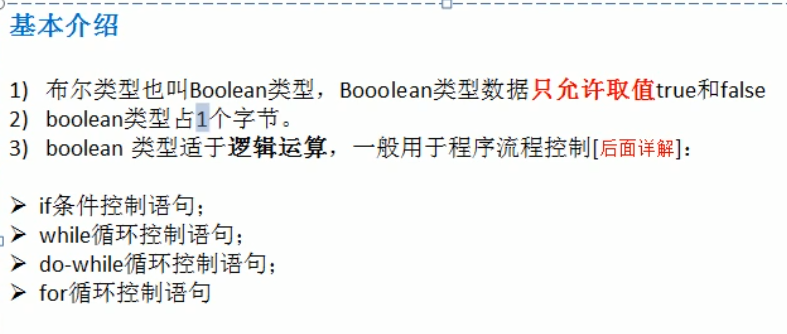
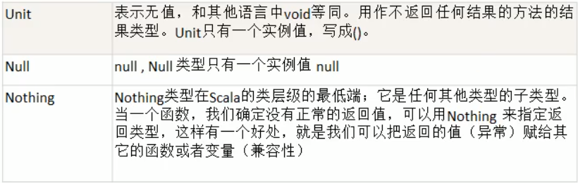
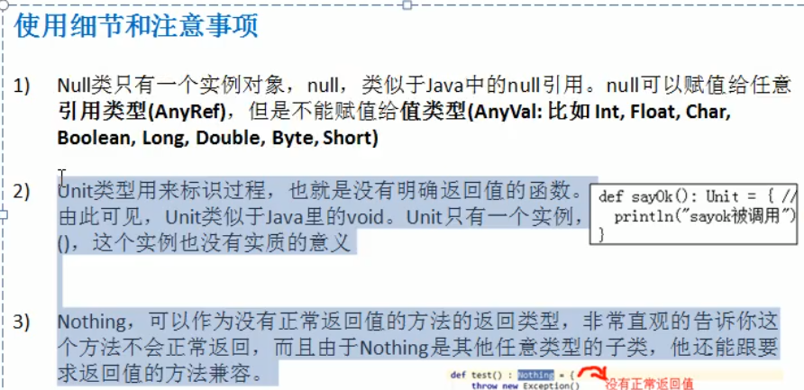

# 020_Null_Nothing_Unit



基本说明





```scala
package com.atguigu.chapter02.datatype

/**
 * ClassName: ${CLASS_NAME} <br/>
 * Description: ${CLASS_NAME} <br/>
 * Date: 2021-03-23 10:46 <br/>
 * <br/>
 *
 * @author yufengming
 * @email yufengming@travelsky.com
 * @project scala
 * @package com.atguigu.chapter02.datatype
 * @version 产品版本信息 2021年03月23日10:46分 yufengming(yufengming@travelsky.com) 新建<br/>
 *          <p>
 *          修改记录
 *
 */
object UnitNullNothingDemo {
  def main(args: Array[String]): Unit = {
    val res = sayHello()
    println(res)

  }

  def sayHello(): Unit = {
    // Null类只有一个实例对象,null,类似于Java中的null引用.null可以赋值给任意类型(AnyRef),
    // 但是不能赋值给值类型(AnyVal: 比如 Int,Float,Char,Boolean,Long,Double,Byte,Short)

  }

  val dog: Dog = null
  val char1: Char = null
  println("ok~~~")


}

class Dog {

}
```

