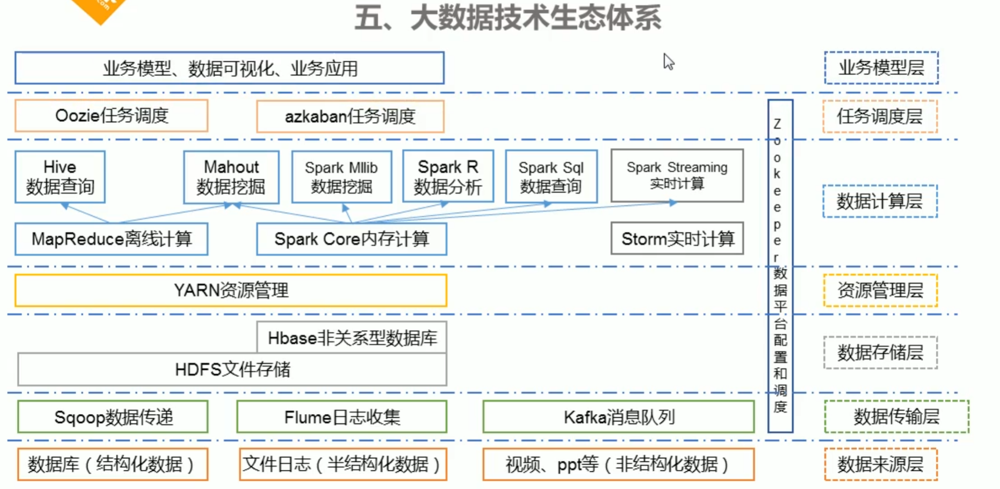

Scala 是一门多范式（multi-paradigm）的编程语言，设计初衷是要集成面向对象编程和函数式编程的各种特性。

Scala 运行在 Java 虚拟机上，并兼容现有的 Java 程序。

Scala 源代码被编译成 Java 字节码，所以它可以运行于 JVM 之上，并可以调用现有的 Java 类库。

视频地址: [传送门](https://www.bilibili.com/video/BV15t411H776)

更多: [在这里](https://victorfengming.gitee.io/course/)

